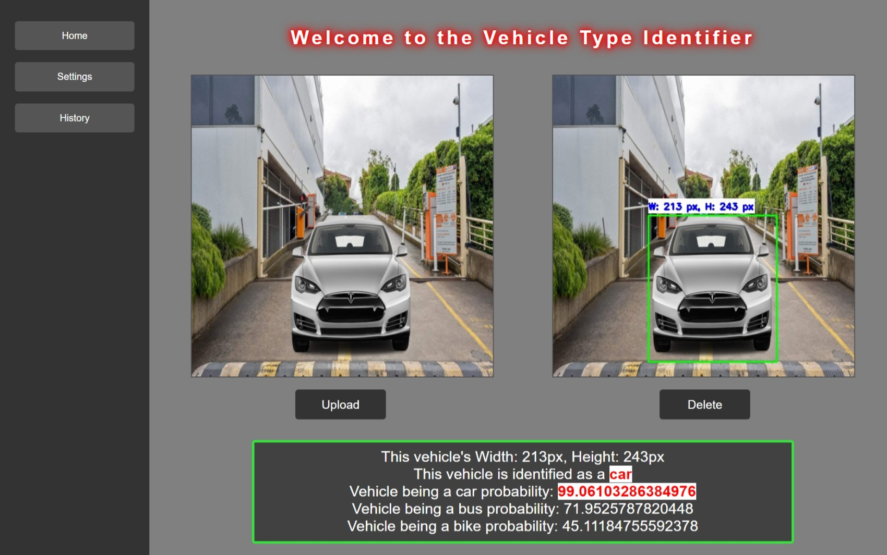
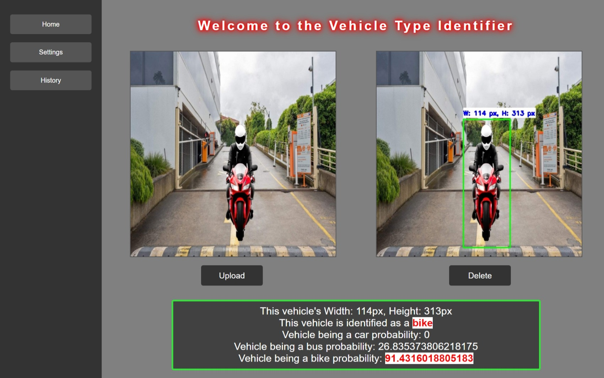
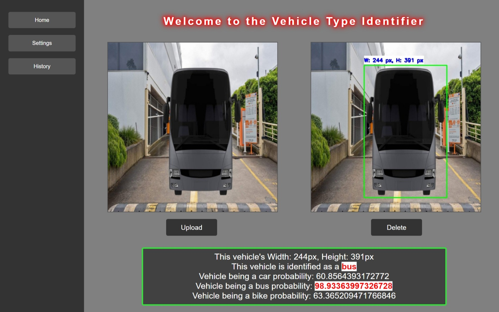
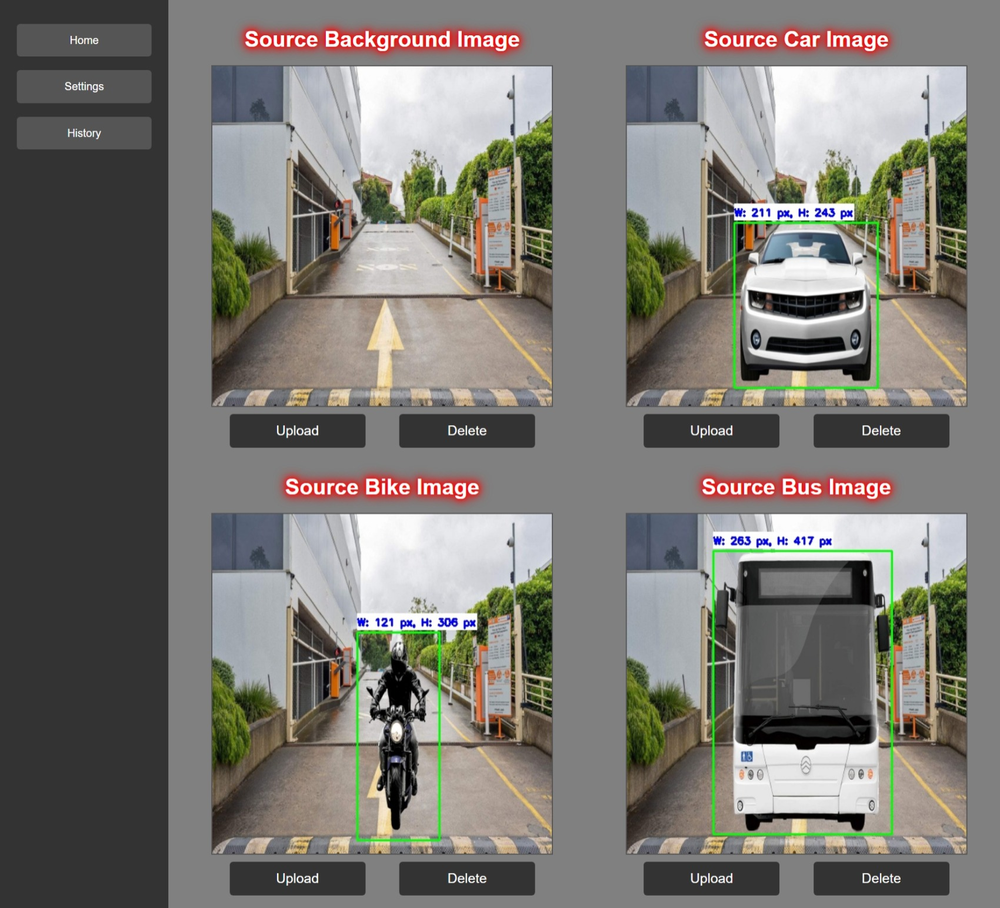
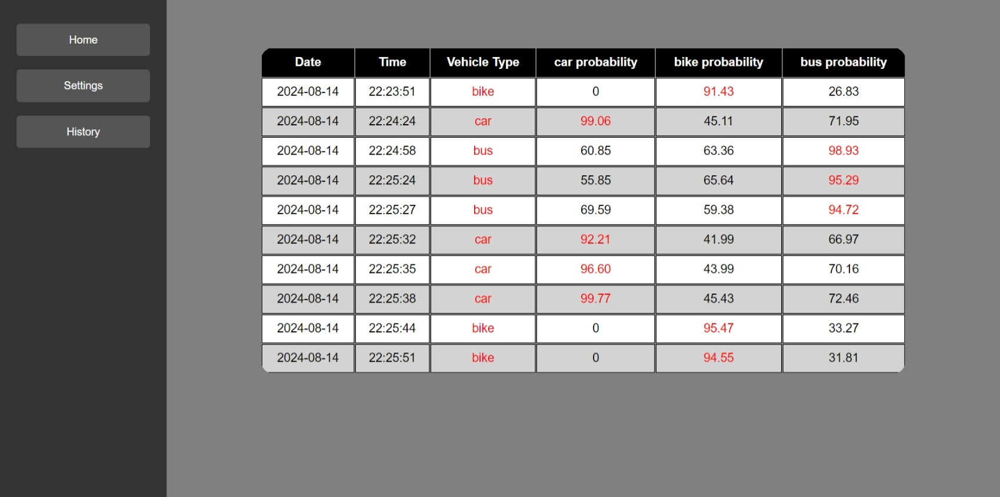

# Vehicle Type Identification System

**VTIS** is a simple and traditional Digital Image Processing application which is written in python.

## Features of the Application

* Vehicle Identification and Classification
* Real-Time Image Processing
* Segmentation and Contour Detection
* Morphological Operations (Dilation) 
* Annotation of Detected Vehicles
* Probability-Based Classification
* Interactive UI for user control
* Visual representation (including crucial outputs)

## Application process flow 

1. **Image Resizing**
    - **Purpose:** Standardizes the input image size for consistent processing.
    - **DIP Aspect:** Ensures uniform dimensions across images, which is essential for reliable feature extraction and algorithm performance.

2. **Grayscale Conversion**
    - **Purpose:** Simplifies image data by reducing it to a single channel.
    - **DIP Aspect:** Reduces computational complexity and focuses on intensity values, making it easier to perform tasks like contour detection.

3. **Gaussian Blurring**
    - **Purpose:** Smooths the image to reduce noise and detail.
    - **DIP Aspect:** Helps in improving the accuracy of segmentation and contour detection by removing fine details that could interfere with processing.

4. **Binary Masking and Segmentation**
    - **Purpose:** Creates a binary mask to isolate the vehicle from the background.
    - **DIP Aspect:** Utilizes thresholding based on pixel intensity differences to segment the vehicle. This is a fundamental technique for object isolation and analysis.

5. **Morphological Operations (Dilation)**
    - **Purpose:** Enhances the binary mask by filling gaps and expanding white areas.
    - **DIP Aspect:** Applies mathematical morphology to refine the mask, improving contour detection and making the vehicle segmentation more robust.

6. **Contour Detection**
    - **Purpose:** Identifies and isolates the boundaries of the vehicle.
    - **DIP Aspect:** Uses edge detection and contour finding algorithms to delineate the shape of the vehicle, enabling measurement and analysis.

7. **Bounding Box Calculation**
    - **Purpose:** Determines the rectangular area surrounding the detected vehicle.
    - **DIP Aspect:** Provides spatial information about the vehicle, such as its position and dimensions within the image.

8. **Bounding Box Annotation**
    - **Purpose:** Draws bounding boxes and adds text annotations to the image.
    - **DIP Aspect:** Enhances visual output by marking the detected vehicle and displaying its dimensions, making it easier to interpret the results.

9. **Aspect Ratio Analysis for Classification**
    - **Purpose:** Classifies the vehicle based on its dimensions relative to known vehicle types.
    - **DIP Aspect:** Uses geometric properties (width and height) to identify and categorize the vehicle, applying pattern recognition techniques based on the aspect ratio.

10. **Probability-Based Classification**
    - **Purpose:** Calculates the likelihood of the vehicle belonging to each predefined type (car, bike, bus) based on its dimensions.
    - **DIP Aspect:** Utilizes mathematical comparisons to provide a quantitative measure for classification, enhancing the decision-making process.

## Digital Image Processing Techniques applied

* Image Resizing 
* Grey Scale conversion
* Gaussian Blur 
* Binary Masking
* Dilation
* Contour Detection
* Bouding Box calculation

## User Interfaces of the Application

  
## AUTHOR 🖋

* [Pubudu Perera]( https://github.com/Pamod45)

## Contributors 🏅

* [Vishan Perera]( https://github.com/VishanPerera)

* [Nisal Wickramaarachchi]( https://github.com/Nisal200212)

## CONTACT 📞

* Pubudu Perera -> [pubupere32@gmail.com](mailto:pubupere32@gmail.com)

